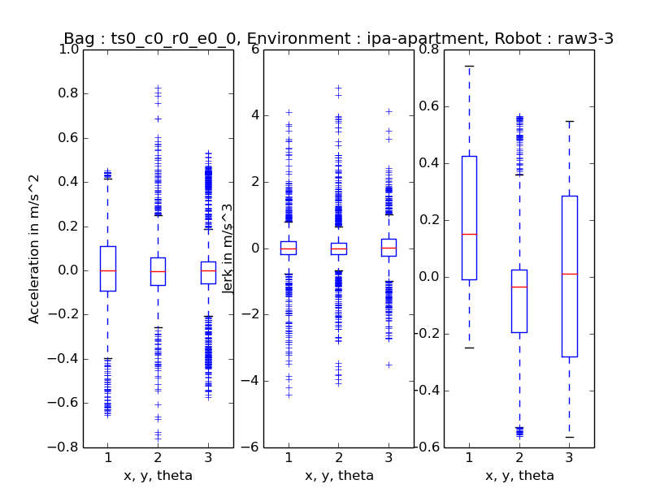

# ATF for ipa_navigation_planning repository

Please view the [README](../README.md) in the parent directory for information regarding the ATF.

### Layout

This atf subdirectory implements:
1. An ATF test to record bagfiles of the robot following a predefined route (see [Robot-Environment-Config](#####Robot-Environment-Config)) containing data relating to the current robot position (state_ekf) and the current velocity (odometry).
1. The atf_bagfile_plotter which presents the recorded data from the bagfile as plots.
1. The [robot_route_recorder](###Robot-Route-Recorder) that is a convenience tool for generating Robot Environment Config files.

### How-to

Set up a workspace with this repository
```sh
mkdir -p atf_ws/src
cd atf_ws/src
git clone git@github.com:ipa-flg-pb/atf.git
git fetch ipa_navigation_planning_indigo
git checkout ipa_navigation_planning_indigo
```
Build your `atf_ws` and source the setup.bash
```sh
cd atf_ws
catkin_make --force-cmake
source devel/setup.bash
```
Now you can run the ATF test from your atf_ws with
```sh
catkin_make atf_ipa_navigation_planning_atf_recording -j1
```
which will start a gazebo simulation (therefore `-j1`) in the recording step of the atf_test during which bagfiles containing state_ekf and odometry data will be recorded. Note that the recording step also triggers the cleaning step erasing all the existing bagfiles in the folder specified in the [Test-Generation-Config](#####Test-Generation-Config) before recording the new ones. Now run the [ATF-Bagfile-Plotter](###ATF-Bagfile-Plotter) with
```sh
roslaunch ipa_navigation_planning_atf atf_bagfile_plotter.launch
```
to present the recorded data. For more details read the section concerning the [ATF-Bagfile-Plotter](###ATF-Bagfile-Plotter).

### Config-Files
##### Test-Generation-Config

This file is used for the specification of the following information:
* Where the other config files are found (suites_file, test_config_path, robot_config_path, robot_env_config_path)
* How often a test is repeated with the same settings (repititions). For each repition a seperate bagfile is recorded.
* The script that is used during the ATF test (app_executable). The application.py contained in this package just publishes the starting_pose from the Robot-Environment-Config files and then sends the goals also sepcified in that Config file in succession once the previous goal has been reached.
* The launch file (additional_launch_file) used to start additional nodes required for the ATF test like gazebo, etc.
* The directory to which the bagfiles are written (bagfile_output). Note that the [ATF-Bagfile-Plotter](###ATF-Bagfile-Plotter) also uses this information th locate the bagfiles.
* How long the recording step is supposed to take at most (time_limit_recording)
* The other parameters are not relevant for this package (json_output, yaml_output, speed_factor_analysis, time_limit_analysing, time_limit_uploading, upload_data, upload_result)

##### Test-Suites

In this file you can define a list of test_suites. A test_suite defines which test, robot and robot_env config files are used together.

##### Bagfile-Plotter-Config

This file specifies the values for the parameters of the ATF-Bafile-Plotter

##### Robot-Environment-Config

Specifies additional parameters and args for the ATF test:
Additional parameters are:
* The "/atf_test/start_pose". Note that this needs to be the pose where the robot is spawned in gazebo (cob_bringup_sim robot.launch).
* A list "/atf_test/goals" containing the goals that are sent to the robot in top-down-order
Note that these information are also used by the ATF-Bagfile-Plotter.
Additional arguments are:
* The name of the robot_env ("robot_env"). This is the value passed as ROBOT_ENV.

##### Robot-Config

This file specifies the following information:
* The topics recorded by the bagfile (list of topics defined for path_length). Without listing the state_ekf and odometry topic they will not be recorded in the bagfiles and the [ATF-Bagfile-Plotter](###ATF-Bagfile-Plotter) will not be able to generate plots. Note that it is not strictly necessary to use the path_length metric but in fact any other ATF metric works as long as it is specified as a metric to be recorded in the Test-Config file.
* The value of ROBOT used during the ATF test is defined by the additional argument "robot".

##### Test-Config

This file defines the test_blocks that should be recorded in the app_executable (see [Test-Generation-Config](#####Test-Generation-Config)). In the application.py cpntained in this package only one test_block is intended. Also the metrics that should by evaluated during the analysing step of the ATF test are specified. Note that you have to incorporate the metric in this list which specifies the topics to be recorded in the [Robot-Config file](#####Robot-Config).

### ATF-Bagfile-Plotter

The atf_bagfile_plotter (abp) searches the bagfile_output directory specified in the [Test-Generation-Config](####Test-Generation-Config) for bagfiles and makes three plots for each bagfile:
* A plot showing the route covered by the robot, the start position and goals and the position of the robot at certain timestamps (Path plot).

* A plot showing different velocity, acceleration and jerk values based on the odometry topic ordered by direction relative to the robot i.e. in x-direction labeled 'x', y-direction labeled'y' and rotation around the z-axis labeled 'theta' (Momentum plot).

* A plot presenting the velocity, acceleration and jerk in boxplots ordered and labeled the same way as the Momentum plot.

Note that most of the things presented in the plots and the plots themselves can be switched on and off in the [Bagfile-Plotter-Config](#####Bagfile-Plotter-Config).

Note: Make sure to enter the correct values for robot and especially robot_env in the atf_bagfile_plotter.launch file; those are **NOT** automatically read from the config files. This will lead to the abp plotting the goals from a potentially wrong route in the path plot.

### Robot-Route-Recorder

The robot_route_recorder (rrr) is used to automatically generate [robot_envs yaml files](#####Robot-Environment-Config) (reyf), specifically tailored for ipa_naviagition_planning_atf.

To use the rrr roslaunch your ipa_navigation_bringup and RVIZ. In the current ipa_navigation indigo setting this should be
```sh
roslaunch ipa_navigation_bringup ipa_navigation.launch
roslaunch ipa_navigation_bringup rviz.launch
```
In addition start the rrr node with
```sh
roslaunch ipa_navigation_planning_atf robot_route_recorder.launch
```

Now you only have to:
1. Send a 2D Pose Estimate in RVIZ; this will be the starting pose written to the reyf
1. Send a number of 2D Nav Goals in RVIZ; those will define the route followed during the atf test
1. Send another 2D Pose Estimate in RVIZ; this will trigger the rrr to generate the reyf from the current data and also safe the new 2D Pose Eestimate as the starting pose for the next reyf

Note: To modify the directory where the reyfs are saved simply modify the robot_route_recorder.launch
