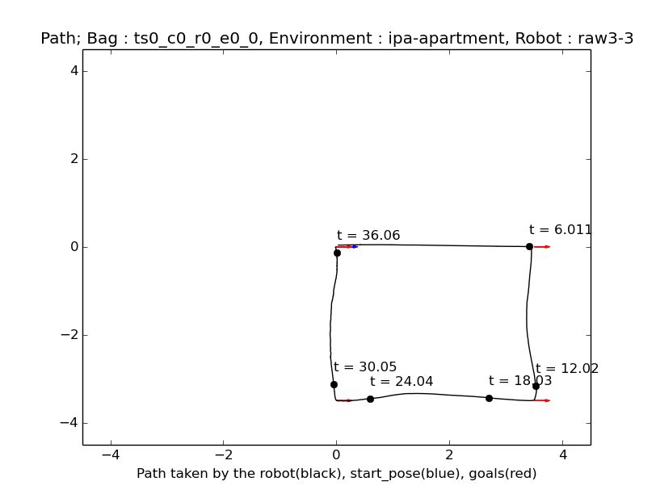

# ATF for ipa_navigation_planning repository

Please view the [README](../README.md) in the parent directory for information regarding the ATF.

### Layout

This atf subdirectory implements:
1. An ATF test to record bagfiles of the robot following a predefined route (see [Robot-Environment-Config](#####Robot-Environment-Config)) containing data relating to the current robot position (state_ekf) and the current velocity (odometry).
1. The the atf_bagfile_plotter which presents the recorded data from the bagfile as plots.
1. The [robot_route_recorder](###Robot-Route-Recorder) that is a convenience tool for generating Robot Environment Config files.

### How-to

Please follow the installation steps described in the installation section of the aforementioned ATF README; then checkout this branch and run
```sh
catkin_make --force-cmake
```
Now you can run the ATF test with
```sh
catkin_make atf_ipa_navigation_planning_atf_recording -j1
```
which will start a gazebo simulation (therefore `-j1`) in the recording step of the atf_test during which bagfiles containing state_ekf and odometry data will be recorded. Now run the [ATF-Bagfile-Plotter](###ATF-Bagfile-Plotter) with
```sh
roslaunch ipa_navigation_planning_atf atf_bagfile_plotter.launch
```
This will open two figures for each recorded bagfile. One showing the path covered by the robot during the simulation



and one showing the plots of velocity, acceleration and jerk in x-direction (labeled x), in y-direction (labeled y) and around the z-axis (labeled theta).


The coordinates are relative to the robot-frame.

### Config-Files
##### Test-Generation-Config
##### Test-Suites
##### Bagfile-Plotter-Config
##### Robot-Environment-Config
##### Robot-Config
##### Test-Config

### ATF-Bagfile-Plotter

The atf_bagfile_plotter (abp) searches the bagfile_output directory specified in the [Test-Generation-Config](####Test-Generation-Config) for bagfiles and makes two plots for each bagfile:
* A plot showing the route covered by the robot
* A plot showing different velocity, acceleration and jerk values based on the odometry topic

### Robot-Route-Recorder

The robot_route_recorder (rrr) is used to automatically generate [robot_envs yaml files](#####Robot-Environment-Config) (reyf), specifically tailored for ipa_naviagition_planning_atf.

To use the rrr roslaunch your ipa_navigation_bringup and RVIZ. In the current ipa_navigation indigo setting this should be
```sh
roslaunch ipa_navigation_bringup ipa_navigation.launch
roslaunch ipa_navigation_bringup rviz.launch
```
In addition start the rrr node with
```sh
roslaunch ipa_navigation_planning_atf robot_route_recorder.launch
```

Now you only have to: - Send a 2D Pose Estimate in RVIZ; this will be the starting pose written to the reyf
                      - Send a number of 2D Nav Goals in RVIZ; those will define the route followed during the atf test
                      - Send another 2D Pose Estimate in RVIZ; this will trigger the rrr to generate the reyf from the current data and also safe the new 2D Pose Eestimate as
                        the starting pose for the next reyf

Note: To modify the directory where the reyfs are saved simply modify the robot_route_recorder.launch
